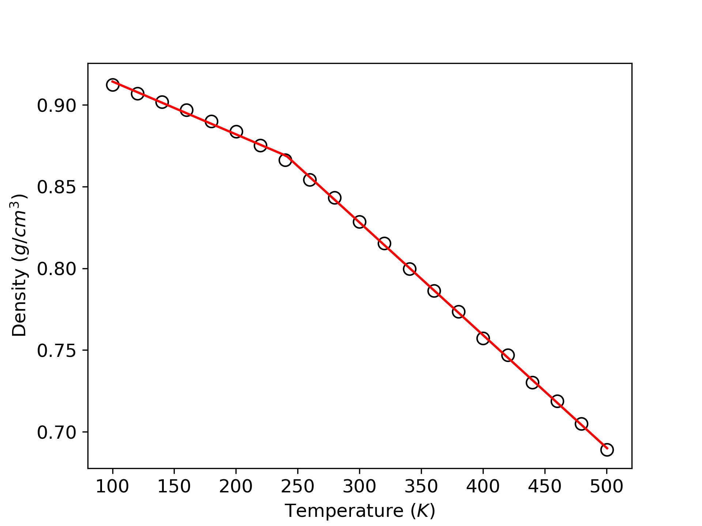

# Tutorial to running Tg simulations

Before you start, make sure PSP and PMD are installed.

As an example, say we want to generate a system for ID: 1 in the [sample list](https://github.com/Ramprasad-Group/HPolymer-Molecular-Dynamics/blob/main/tutorials/Tg/Sample_list_of_SMILES.csv)

Run: `python mkinput_Tg.py 1`

The `mkinput_Tg.py` file takes 1 input argument that is the id of the polymer in [sample list](https://github.com/Ramprasad-Group/HPolymer-Molecular-Dynamics/blob/main/tutorials/Tg/Sample_list_of_SMILES.csv).

This should generate a folder with polymer id as the name with all the necessary files for running MD simulation on PACE. Simply upload the folder on PACE and `cd` to the directory and do `qsub job.pbs`.

## Result

    

